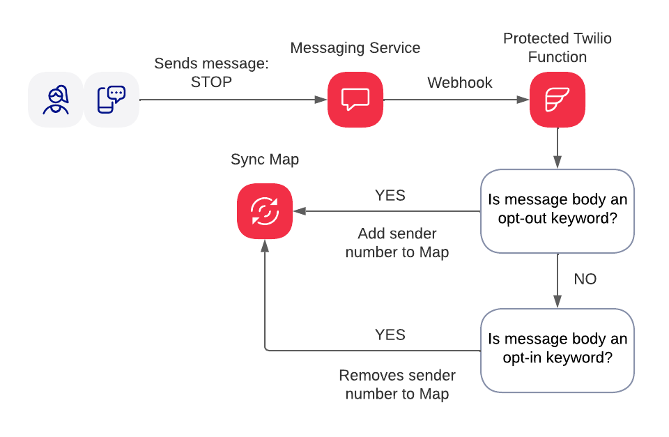

# mms-private-media

## Project summary

This project shows how you can leverage Twilio Function and Sync to store opt-out data on Twilio platform.

Being compliant as part of your messaging strategy is highly important. It ensures that your senders have high trust level from carriers and as a result lower filtering and lower risk of being blocked. Opt-out is one of the key pillars in compliant messaging. Twilio platform helps you to maintain customer trust via automated opt-out management (more on this you can find here) and this is great for the start, but under certain circumstances opt-out information can be lost (i.e. moving sender to a different Messaging Service, deleting Messaging Service, etc.) It can also be a problem if at later point in time you would like to export this data to use elsewhere as for now Twilio platform does not provide an API to retrieve opt-out data (exporting list of messages and filtering for opt-out words could be a workaround, but it has a drawback that you would have to merge opt-outs with opt-ins in order to get accurate data). Thus we at Twilio strongly recommend our customers to not rely 100% on the automatic opt-out but store the data yourself. Often times we see our customers perplexed by this advice as they might not have infrastructure to process and database to store this information. This is why I decided to write this blog post and show you how storing opt-out information can be done on Twilio platform with Serverless Functions and Sync.

For more details on the project head to the blogpost [here.](https://www.twilio.com/blog/tag/functions)

## Diagram



## Developer environment setup
Make sure you have the software you need:

- [node.js](https://nodejs.org/) and [npm](https://docs.npmjs.com/downloading-and-installing-node-js-and-npm)
- [Twilio CLI](https://www.twilio.com/docs/twilio-cli/quickstart)
- [Twilio Serverless Toolkit](https://www.twilio.com/docs/labs/serverless-toolkit)

## Environment variables

```shell
ACCOUNT_SID=<Twilio Account SID>
AUTH_TOKEN=<Twilio Auth Token>
SYNC_SERVICE_SID=<Sync Service SID>
SYNC_MAP_SID=<Sync Map SID>
```

## Available scripts
`npm run start` - starts project locally
`npm run deploy` - deploys project to Twilio Functions using credentials from .env file

## Tutorial
The blogpost with tutorial for this project you will find [here.](https://www.twilio.com/blog/tag/functions)

## Disclaimer
The project published as-is as sample code.